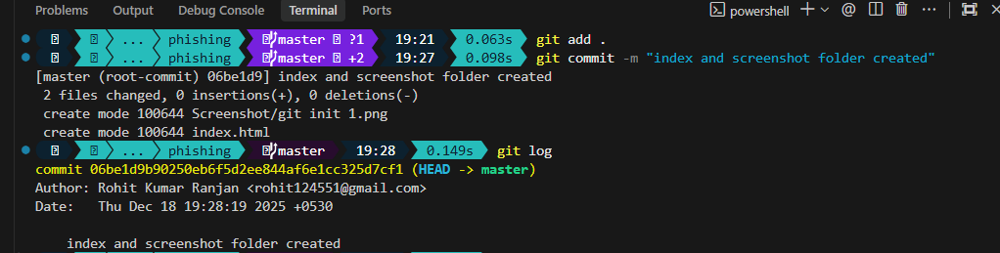
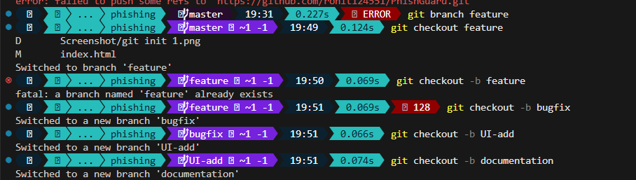
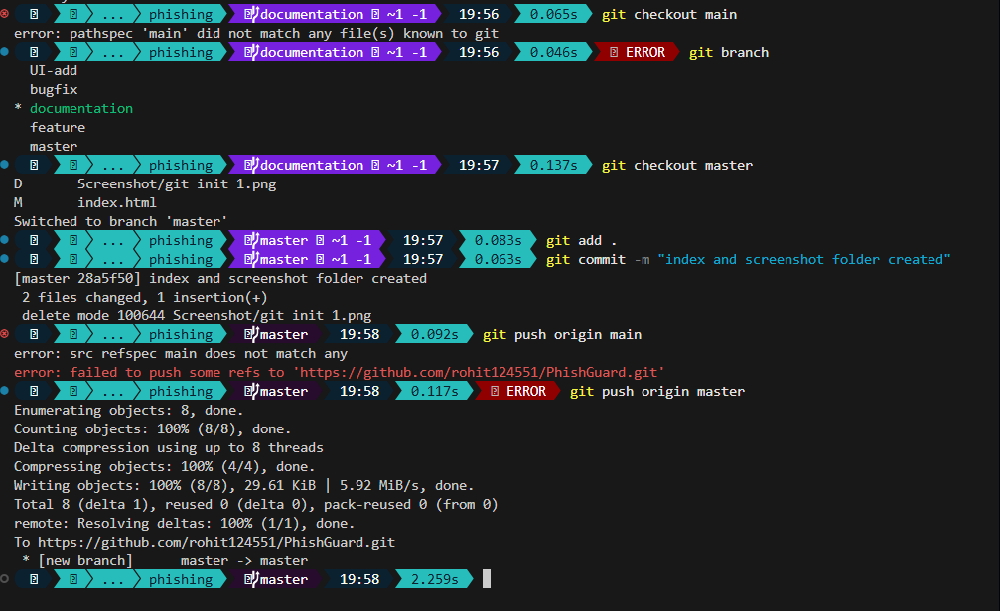

# PhishGuard | Advanced URL Scanner

## Introduction
**PhishGuard** is a client-side web application designed to help users identify potential phishing threats in real-time. By analyzing URL patterns, heuristics, and known malicious indicators, PhishGuard provides a safety score and detailed risk assessment without needing a backend server.

The application features a modern, responsive Glassmorphism design that ensures a premium user experience across all devices.

## Features
- **Heuristic Analysis**: Detects IP usage, typosquatting, suspicious TLDs, and extensive subdomains.
- **Homoglyph Detection**: Identifies characters that look identical to standard Latin characters (e.g., Cyrillic 'a' vs Latin 'a').
- **Real-time Scoring**: distinct visual safety scores (Safe, Suspicious, High Risk).
- **Responsive Design**: Fully mobile-compatible layout.

## Commands
To run this project locally:

1.  **Clone the Repository**
    ```bash
    git clone https://github.com/rohit124551/PhishGuard.git
    cd PhishGuard
    ```

2.  **Run the Application**
    Since this is a static web application, you can simply open `index.html` in your browser.
    
    *VS Code Live Server:*
    - Right-click `index.html`
    - Select "Open with Live Server"

## Screenshots

### Application Interface

*The main dashboard interface.*


*Detailed risk breakdown.*


*Responsive mobile layout.*

### Development Workflow
We utilized a structured Git workflow for development, including branching and merging strategies.

| Action | Screenshot |
| :--- | :--- |
| **Git Init & Setup** |  |
| **Branch Creation** |  |
| **Pulling Updates** |  |
| **Merge Log** |  |
| **Feature Merge** |  |

## Challenges

### 1. Client-Side Heuristics
Developing a robust detection algorithm purely in JavaScript was minimal. Without a backend database of known blacklists, we had to rely on logical patterns (high entropy, specific keywords, homoglyphs) to estimate risk.

### 2. Animation Concurrency
Handling user interactions, such as rapid clicking of the "Scan" button, caused the score counter to glitch. This was resolved by implementing strict interval management in the JavaScript logic.

### 3. Glassmorphism Compatibility
Creating a "glass" effect that remained legible and performant on older mobile devices required careful tuning of `backdrop-filter` and fallback background colors.

## Conclusion
PhishGuard demonstrates how effective client-side security tools can be when combined with modern web technologies. By prioritizing user experience and immediate feedback, it empowers users to make safer browsing decisions. Future updates will include integration with public phishing APIs for even greater accuracy.
